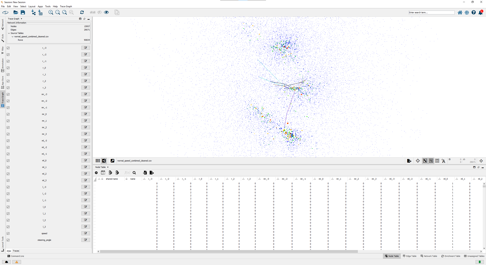
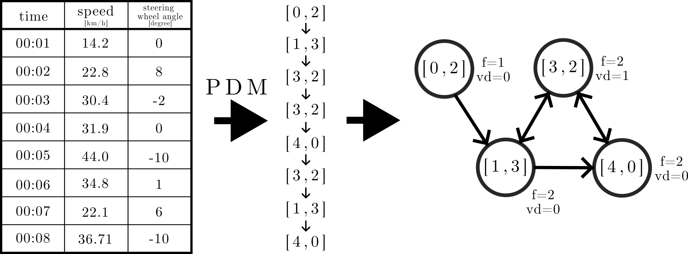

# Trace Graph Engineering Tool

A Cytoscape plugin for working with Trace Graphs.

A Trace Graph is a directed graph built from driving traces. Each node represents a discretized driving situation, and each edge represents a transition between states.

The project was developed as part of the thesis "Design and Implementation of a Tool for the Analysis and Exploration of Trace Graphs". More background is provided in the [thesis](thesis.pdf).

  

The plugin can:

- Import a Parameter Discretization Model (PDM) or a raw trace from the Cytoscape `File -> Import` menu.
- Export the current PDM as JSON from `File -> Export`.
- Switch between `All-Edges Mode`, `Outgoing-Edges Mode`, and `Subtraces Mode`.
- Show a concrete trace for a selected node.
- Compare two trace graphs.
- Merge two trace graphs.
- Split a trace graph into separate graphs based on selected source traces.
- Apply a percentile-based filter to hide less relevant nodes.
- Inspect and edit discretization parameters in the side panel.

## UI

The plugin adds a panel to Cytoscape's west side bar. Depending on the current selection, it shows:

- PDM configuration and parameter bins.
- Network statistics and source trace tables.
- Node details for a single selected node.
- Node comparison for small multi-node selections.
- Trace graph comparison views.
- Rendering-mode-specific controls.

## Input

The import supports two kinds of input:

1. A PDM JSON file.
2. A raw trace in CSV format.

When importing a PDM JSON, the plugin can also load referenced CSV traces directly.

When importing a CSV directly, the plugin derives the parameter set from the table columns and either:

- attaches the trace to an existing compatible PDM, or
- creates a new PDM automatically.
